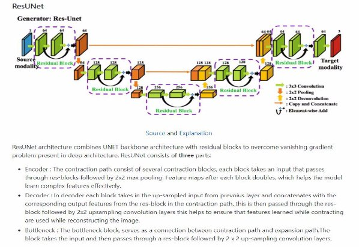
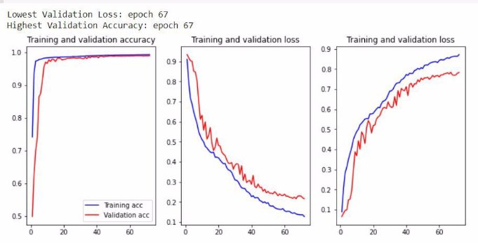

**Brain tumor segmentation **

**with RESUNET/UNET**

**Using UNET to determine brain tumors**

**By-**

**Shivansh Singla**

**UIET CSE**

**Explaining the problem**

**We are given various images of brain scans and brain tumor masks corresponding to it.Our goal is to  train our model such that given an image of brain it should be able to detect the tumor .** 

**Dataset description**

Our dataset has 4 folders

1. Images contain the images of brain scans. 
1. Masks contain the segmented tumors which we need to detect 
1. Saliency maps 1 
1. Saliency maps 2 
1. Approx size of dataset 900MB 
1. Thera are 3064 images and masks 

What Is a Mask?

The goal of image segmentation is to understand image at the pixel level. It associates each pixel with a certain class. The output produced by image segmentation model is called MASK of the 

image.

Mask can be represented by associating pixel values with their coordinates for example it we have a 

black image of shape (2,2) this can be represented as: [[0,0], [0,0]]

If our output mask is as follows: [[255,0], [0,255]]

To represent this mask we have to first flatten the image into a 1-D array. this would result in something like [255,0,0,255] for mask . then we can use the index to create the mask. finally we would have something like [1,0,0,1] as our mask.

**How to download the **

**dataset**

We will be using Kaggle API to download the dataset

1. Install kaggle package in python using !pip install kaggle.You can check if its already present using !pip show kaggle.
1. Upload the kaggle.json file which contains the api key to root directory ~/.kaggle/kaggle.json
1. Use !kaggle competitions download -c state-farm-distracted-driver-detection to download it in zip format

**Loading/Analysing/Cleaning the data**

1. The dataset is in zip folder so first we need to unzip the dataset which can simply be done by

a. !unzip /content/brain-tumor-dataset-with-saliency.zip

2. First we need the natsort library which is used to perform natural sort on strings i.e 1,2,3,4,10 instead of 1,10,2,3,4
2. Since correspondence of images and masks are messed up natsort will bring them in order
2. We need to eliminate folders from images and masks that can be done by running a loop and only including files and skipping folders

a. os.path.isfile(img\_path + '/' + i)  if this is false we skip because path is a folder

5. Then we declare np array of all zeros which has the shape of (images,image\_dimensions)
5. Then we run a loop loading and processing each image before storing it in X,Y which contain the brain images and masks respectively 

**Image preprocessing**

1. Initially sizes of images is 512\*512\*3 which we change to 256\*256\*1 grayscale
1. We also normalize the pixel intensities by bringing them b/w 0 and 1 by dividing them by 255.0
1. 255.0 because they need to be in float

**What are Saliency Maps?**

1. Saliency Map is an important concept of deep learning and Computer vision. While training images of birds how does CNN knows to focus on bird-related pixels and ignore the leaves and the other background things in the image? By using the concept of Saliency Map. 
1. Saliency Map is an image in which the brightness of a pixel represents how salient the pixel is i.e brightness of a pixel is directly proportional to its saliency. It is generally a grayscale image. 
1. Saliency maps are also called as a heat map where hotness refers to those regions of the image which have a big impact on predicting the class which the object belongs to. 
1. Here is an example, the picture shown in the right is the saliency map of the left one which shows the regions which are more attentive part to CNN. 

**UNET ARCHITECTURE**

1. The model architecture is fairly simple:
1. an encoder (for downsampling)
1. a decoder (for upsampling) with skip connection
2. it shapes like the letter U hence the name U-Net.

**resUNET ARCHITECTURE**

` `

**Why are we using Dice score instead of binary cross **

**entropy**

1. The main reason that people try to use dice coefficient or IoU directly is that the actual goal is maximization of those metrics, and cross-entropy is just a proxy which is easier to maximize using backpropagation.
1. In addition, Dice coefficient performs better at class imbalanced problems by design:
1. More advanced reasons can be found here - [https://stats.stackexchange.com/questions/321460/dice-coefficient-loss-function-vs-cross -entropy](https://stats.stackexchange.com/questions/321460/dice-coefficient-loss-function-vs-cross-entropy)
1. Even on checking the training stats you will notice that accuracy has be pretty much constant since the start only reason but dice score has been constantly improving

**Measures to prevent overfitting and improve **

**score**

1. I am using Early stopping on val\_dice\_loss to make sure that score doesn’t get bad
1. Score can be improved to become way better by using more epochs I just used 75 due to time constraints 300 is probably a good number

**Training statistics visualized of** 

**UNET**

**resUNET**

**COMPARING results**

UNET MODEL

RESUNET MODEL

**Visualizing the results**
